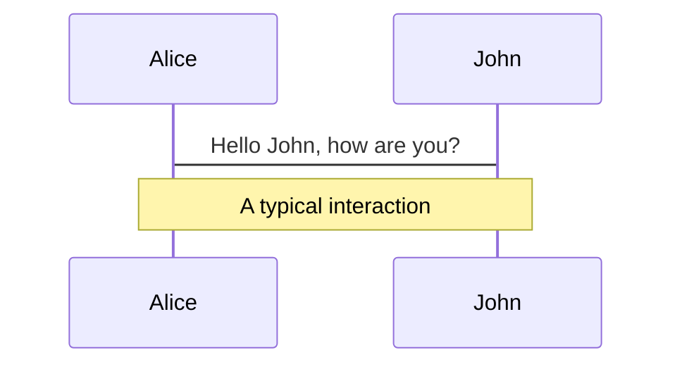
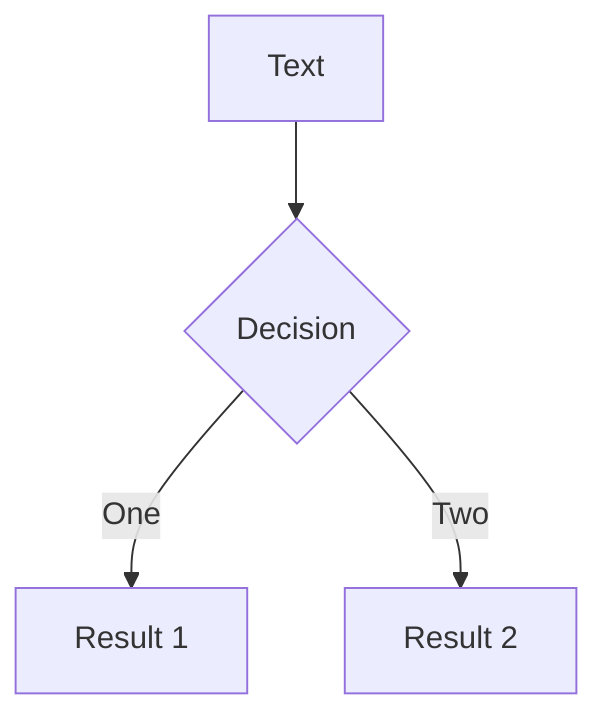
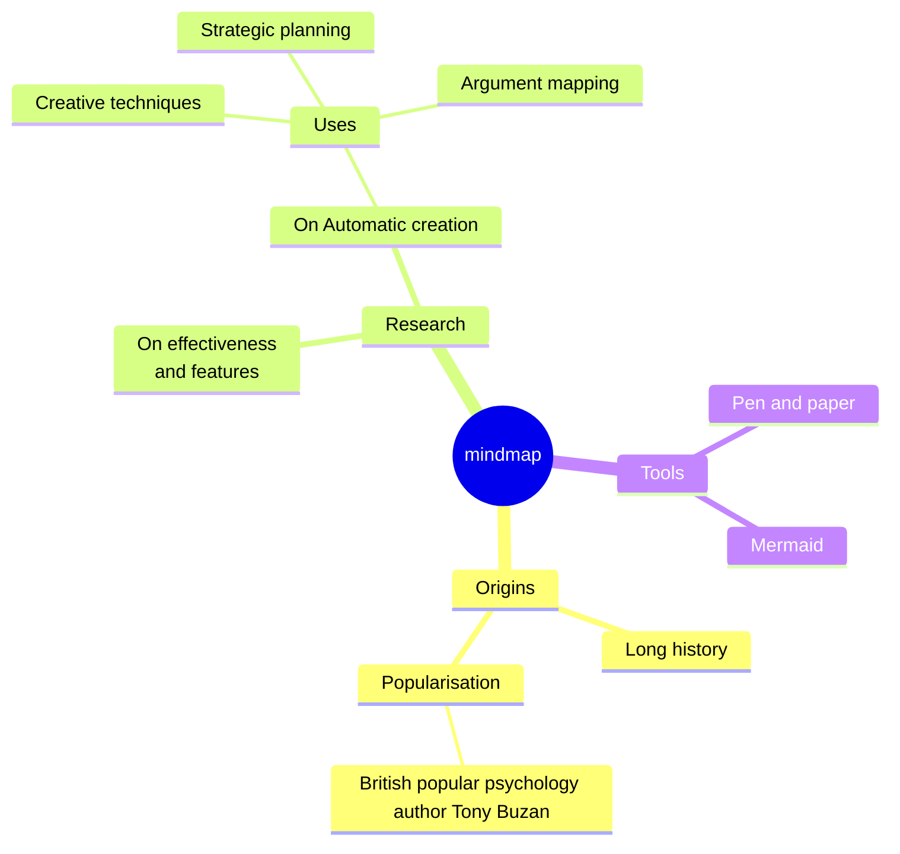
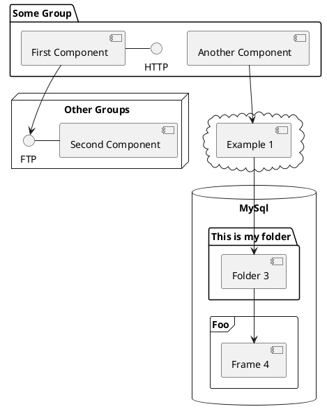

---
# You can also start simply with 'default'
theme: seriph
# random image from a curated Unsplash collection by Anthony
# like them? see https://unsplash.com/collections/94734566/slidev
background: https://cover.sli.dev
# some information about your slides (markdown enabled)
title: 周一pre
info: |
  ## Slidev Starter Template


  Learn more at [Sli.dev](https://sli.dev)
# apply unocss classes to the current slide
class: text-center
# https://sli.dev/features/drawing
drawings:
  persist: false
# slide transition: https://sli.dev/guide/animations.html#slide-transitions
transition: slide-left
# enable MDC Syntax: https://sli.dev/features/mdc
mdc: true
---

# Welcome 


<div @click="$slidev.nav.next" class="mt-12 py-1" hover:bg="white op-10">
  点击到下一页<carbon:arrow-right />
</div>

<div class="abs-br m-6 text-xl">
  <button @click="$slidev.nav.openInEditor" title="Open in Editor" class="slidev-icon-btn">
    <carbon:edit />
  </button>
  <a href="https://github.com/slidevjs/slidev" target="_blank" class="slidev-icon-btn">
    <carbon:logo-github />
  </a>
</div>

<!--
The last comment block of each slide will be treated as slide notes. It will be visible and editable in Presenter Mode along with the slide. [Read more in the docs](https://sli.dev/guide/syntax.html#notes)
-->

---
transition: fade-out
---

# 科研轮转

<br>
<br>

- 第一期轮转目前仅仅听了一次组会
<br>
<br>
- 第二期轮转正在学习老师发的资料
<br>
<br>
- 第三期上个学期刚与老师交流过要做的方向

<br>
<br>
- 感觉自己什么都还没做


---
transition: fade-out
---

# 什么是 Slidev?

Slidev 是一个为开发者设计的幻灯片制作和演示工具，具有以下特点：

- 📝 **基于文本** - 使用 Markdown 专注于内容创作，之后再进行样式设计
- 🎨 **可定制主题** - 主题可以作为 npm 包共享和重复使用
- 🧑‍💻 **对开发者友好** - 代码高亮、带自动补全的实时编码
- 🤹 **交互性强** - 嵌入 Vue 组件以增强表达能力
- 🎥 **内置录制** - 内置录制功能和摄像头视图
- 📤 **可移植** - 导出为 PDF、PPTX、PNG，甚至是可托管的 SPA 网页
- 🛠 **可定制** - 网页上几乎所有可能的功能在 Slidev 中都可实现
<br>
<br>

Read more about [Why Slidev?](https://sli.dev/guide/why)

<!--
You can have `style` tag in markdown to override the style for the current page.
Learn more: https://sli.dev/features/slide-scope-style
-->

<style>
h1 {
  background-color: #2B90B6;
  background-image: linear-gradient(45deg, #4EC5D4 10%, #146b8c 20%);
  background-size: 100%;
  -webkit-background-clip: text;
  -moz-background-clip: text;
  -webkit-text-fill-color: transparent;
  -moz-text-fill-color: transparent;
}
</style>

<!--
Here is another comment.
-->

---
layout: two-cols
layoutClass: gap-16
---

# 生成目录

使用`Toc`组件可以自动生成目录

```html
<Toc minDepth="1" maxDepth="1" />
```

::right::

<Toc minDepth="1" maxDepth="1" />

---
layout: image-right
image: https://cover.sli.dev
---

# Code

代码高亮，动画展示

```ts {all|5|7|7-8|10|all} twoslash
// TwoSlash enables TypeScript hover information
// and errors in markdown code blocks
// More at https://shiki.style/packages/twoslash

import { computed, ref } from 'vue'

const count = ref(0)
const doubled = computed(() => count.value * 2)

doubled.value = 2
```

<arrow v-click="[4, 5]" x1="350" y1="310" x2="195" y2="334" color="#953" width="2" arrowSize="1" />

<!-- This allow you to embed external code blocks -->
<<< @/snippets/external.ts#snippet

<!-- Footer -->

[Learn more](https://sli.dev/features/line-highlighting)

<!-- Inline style -->
<style>
.footnotes-sep {
  @apply mt-5 opacity-10;
}
.footnotes {
  @apply text-sm opacity-75;
}
.footnote-backref {
  display: none;
}
</style>

<!--
Notes can also sync with clicks

[click] This will be highlighted after the first click

[click] Highlighted with `count = ref(0)`

[click:3] Last click (skip two clicks)
-->

---
level: 2
---

# 魔法移动


在代码块前面加上````md magic-move````(四个反引号,代码末尾也要加上四个反引号)可以启用魔法移动。例如：
````md magic-move {lines: true}
```ts {*|2|*}
// step 1
const author = reactive({
  name: 'John Doe',
  books: [
    'Vue 2 - Advanced Guide',
    'Vue 3 - Basic Guide',
    'Vue 4 - The Mystery'
  ]
})
```

```ts {*|1-2|3-4|3-4,8}
// step 2
export default {
  data() {
    return {
      author: {
        name: 'John Doe',
        books: [
          'Vue 2 - Advanced Guide',
          'Vue 3 - Basic Guide',
          'Vue 4 - The Mystery'
        ]
      }
    }
  }
}
```

```ts
// step 3
export default {
  data: () => ({
    author: {
      name: 'John Doe',
      books: [
        'Vue 2 - Advanced Guide',
        'Vue 3 - Basic Guide',
        'Vue 4 - The Mystery'
      ]
    }
  })
}
```

Non-code blocks are ignored.

```vue
<!-- step 4 -->
<script setup>
const author = {
  name: 'John Doe',
  books: [
    'Vue 2 - Advanced Guide',
    'Vue 3 - Basic Guide',
    'Vue 4 - The Mystery'
  ]
}
</script>
```
````

---
class: px-20
---

# 主题

Slidev 提供强大的主题支持。主题可以提供样式、布局、组件，甚至是工具配置。只需在前言部分**一处修改**即可切换主题：

<div grid="~ cols-2 gap-2" m="t-2">

```yaml
---
theme: default
---
```

```yaml
---
theme: seriph
---
```


</div>

Read more about [How to use a theme](https://sli.dev/guide/theme-addon#use-theme) and
check out the [Awesome Themes Gallery](https://sli.dev/resources/theme-gallery).


---

# LaTeX

天然支持Latex公式，并且一样能够高亮和动画
<div h-3 />
内联公式
```latex
 $\sqrt{3x-1}+(1+x)^2$
```

 $\sqrt{3x-1}+(1+x)^2$

Block
$$ {1|2|all}

\begin{aligned}
\nabla \cdot \vec{E} &= \frac{\rho}{\varepsilon_0} \\
\nabla \cdot \vec{B} &= 0 \\
\nabla \times \vec{E} &= -\frac{\partial\vec{B}}{\partial t} \\
\nabla \times \vec{B} &= \mu_0\vec{J} + \mu_0\varepsilon_0\frac{\partial\vec{E}}{\partial t}
\end{aligned}
$$

[Learn more](https://sli.dev/features/latex)

---

# 表格
你可以直接在 Markdown 中通过文本描述创建图表/图形。

<div class="grid grid-cols-4 gap-5 pt-4 -mb-6">









</div>

Learn more: [Mermaid Diagrams](https://sli.dev/features/mermaid) and [PlantUML Diagrams](https://sli.dev/features/plantuml)


---

# Monaco Editor

Slidev 提供内置的 Monaco 编辑器支持。

在代码块中添加 `{monaco}` 可以将其转换为编辑器：

```ts {monaco}
import { ref } from 'vue'
import { emptyArray } from './external'

const arr = ref(emptyArray(10))
```

使用 `{monaco-run}` 可以创建一个能够直接在幻灯片中执行代码的编辑器：

```ts {monaco-run}
import { version } from 'vue'
import { emptyArray, sayHello } from './external'

sayHello()
console.log(`vue ${version}`)
console.log(emptyArray<number>(10).reduce(fib => [...fib, fib.at(-1)! + fib.at(-2)!], [1, 1]))
```

---
layout: center
class: text-center
---

# Learn More

[Documentation](https://sli.dev) · [GitHub](https://github.com/slidevjs/slidev) · [Showcases](https://sli.dev/resources/showcases)

<PoweredBySlidev mt-10 />
